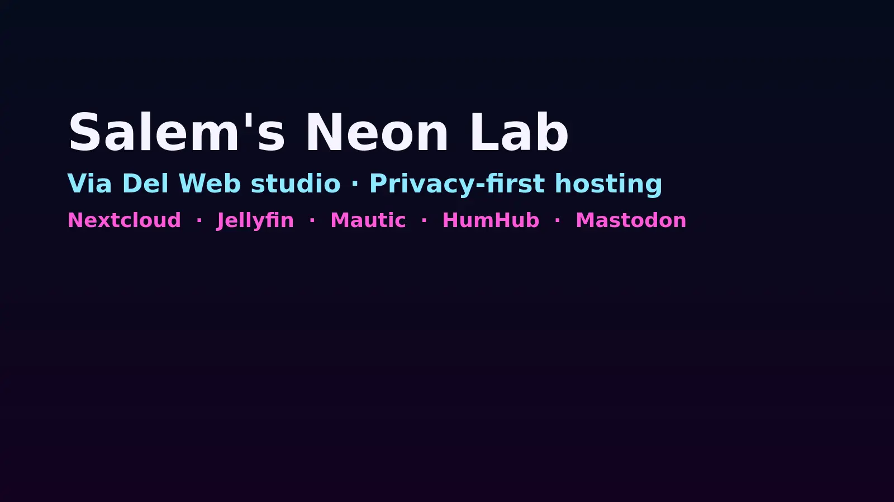
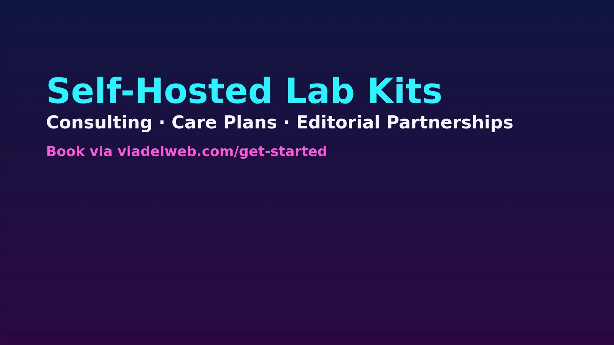

# Salem's Neon Lab Hub

[](https://github.com/itsteddydev/hub-itsteddydev) [](https://opensource.org/licenses/MIT) [](https://astro.build/themes/details/personal-hub-a-customizable-personal-link/)



## Description

This fork personalizes the Personal Hub theme for **Salem Mackintosh-Benitez**—lead at Via Del Web and caretaker of a privacy-first self-hosted lab powered by Debian, Nextcloud, Jellyfin, Mautic, HumHub, and Mastodon. The site balances bilingual copy, neon noir visuals, and cards that highlight Salem's projects, writing, resources, hobbies, and lab services.

If you're adapting the project for your own persona, you can keep the structure but tune the copy, images, and tokens described below.

## Table of Contents

- [Features](#features)
- [Technologies Used](#technologies-used)
- [Installation](#installation)
- [Usage](#usage)
- [Salem-specific tweaks](#salem-specific-tweaks)
- [Screenshots](#screenshots)
- [License](#license)
- [Contact](#contact)

## Features

- **Centralized Management**: Access all your information from a single place.
- **Customization**: Configure and adapt the interface to your needs.
- **Integrations**: Connect with various platforms and external services.
- **Security**: Protect your data with proper authentication and authorization.
- **Bilingual copy**: All strings are stored in `src/i18n/en.json` and `src/i18n/es.json` so the Salem storyline is mirrored in both languages.
- **Self-hosted data sources**: Projects, resources, and services are now hard-coded to Salem's public properties (Via Del Web, Ghost blog, BoldLatina column, etc.).

## Technologies Used

- **Astro**: Main framework for building the interface.
- **Tailwind CSS**: Styling and responsive design.
- **Vercel**: Deployment and hosting of the application.

## Installation

You can use this template in two ways:

### 1. Quick Start (Recommended)

Create a new project using this template with:

```bash
npm create astro@latest -- --template itsteddydev/hub-itsteddydev
```

### 2. Manual Installation

Follow these steps to install and run the project locally:

1. **Clone the repository**:

   ```bash
   git clone https://github.com/itsteddydev/hub-itsteddydev.git
   ```

2. **Navigate to the project directory**:

   ```bash
   cd hub-itsteddydev
   ```

3. **Install dependencies**:

   ```bash
   npm install
   ```

4. **Start the development server**:

   ```bash
   npm run dev
   ```

5. Open your browser and visit `http://localhost:4321` to see the application in action.

## Usage

Once the application is running, you can:

- **Customize your profile**: Add, edit, or remove personal information.
- **Add links**: Include links to your projects, social media, or any relevant resources.
- **Configure widgets**: Enable or disable modules according to your preferences.

## Salem-specific tweaks

- **SEO and metadata** are authored in `src/i18n/*.json`, `src/components/App.astro`, and `src/layouts/Layout.astro`.
- **Hero** and **Social ribbon** live in `src/components/index/Hero.astro` and `src/components/index/SocialMedia.astro`. Swap imagery inside `public/img/portrait-salem.jpg`.
- **Data tabs** pull from `src/data/projects.js`, `articles.js`, `bookmarks.js`, `educationhub.js`, and `funhobbies.js`. Follow the `Card`/`CardDocuments` props when adding new entries.
- **Lab services** cards live inline inside `src/components/ShopNow.astro`. Replace or extend with your own offerings.
- **Design tokens** are centralized in `tailwind.config.mjs`. Keep the semantic names (`hub-background`, `hub-border`, etc.) so components inherit the neon palette automatically.
- **Branding assets** live under `public/img/branding/` and `public/img/cover/`.

## Screenshots




## License

This project is licensed under the MIT License. See the [LICENSE](./LICENSE) file for more details.

## Contact

For inquiries, suggestions, or feedback, you can reach me through:

- **LinkedIn**: [itsteddydev](https://www.linkedin.com/in/itsteddydev/)
- **Twitter**: [@itsteddydev](https://twitter.com/itsteddydev)

---

Thank you for using Salem's Neon Lab Hub! We hope this tool helps you efficiently organize and centralize your information.
